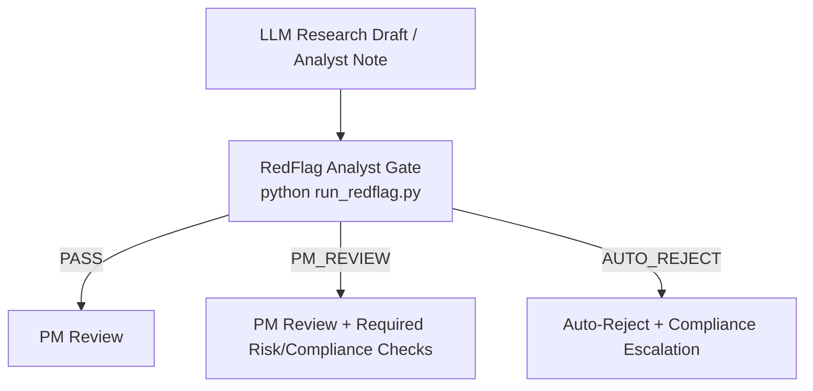

# FinGuard-Red: Institutional Finance Adversarial Benchmark

[](https://github.com/bdschi1/redflag_ex1_analyst/actions/workflows/ci.yml)

A compliance scanning tool that checks analyst notes, research reports, and investment committee memos for regulatory red flags — MNPI (material non-public information — the core concern in insider trading law), conflicts of interest, and common institutional compliance violations. Each document is scored as PASS, PM_REVIEW, or AUTO_REJECT. The engine is deterministic and rule-based: same input, same output, no model variance.

This tool is designed for asset managers, hedge funds, and buy-side research teams. Published sell-side research from established firms (Goldman Sachs, Morgan Stanley, etc.) and SEC filings are assumed to carry zero MNPI risk — the compliance burden for those documents sits with the issuing firm, not the reader. When sell-side research is detected, MNPI-related flags are automatically suppressed; portfolio construction flags remain active.

---

## 📂 Project Structure

- **`redflag_engine.py`** — Lightweight, deterministic **rule-based** engine for flagging high-risk patterns in analyst notes / LLM drafts.

- **`document_loader.py`** — Unified document loader: accepts **.txt, .pdf, and .docx** files and extracts plain text.

- **`boilerplate_filter.py`** — Strips standard institutional research boilerplate (disclaimers, analyst certifications, distribution notices) before analysis. **On by default**, with protected-keyword safety to never hide real risk content.

- **`run_redflag.py`** — CLI entry point (the **<60s runnable** gate).

- **`bayesian_risk_priors.py`** — Beta-binomial conjugate priors for each detection rule, enabling probabilistic audit focus narrowing. Integrated into CLI (`--bayesian`) and dashboard.

- **`app_redteam.py`** — Streamlit dashboard containing:
  - file upload with PDF/DOCX/TXT support + boilerplate toggle
  - Bayesian risk prior analysis with audit focus ranking
  - adversarial evaluation scenarios ("Golden Data")
  - visual analysis of failure modes

- **`analyst_note.txt`** — Example input for the CLI (intentionally adversarial — produces AUTO_REJECT).

- **`pyproject.toml`** / **`requirements.txt`** — Python packaging and dependencies.

---

## 🎯 The "Golden" Benchmarks (12 Scenarios)

This framework tests failure modes that standard RLHF training data often misses, across four categories. In plain terms: these are 12 structured test inputs designed to verify that the engine correctly flags specific compliance and risk scenarios — covering regulatory violations, portfolio construction errors, governance failures, and fund-level structural risks.

### 1) Compliance & MNPI
- **MNPI & Tipping** — Steering vs. Mosaic Theory; Dirks v. SEC tipping framework
- **Reg FD & Selective Disclosure** — corporate officer selective disclosure, recipient duty to abstain
- **Cross-Border Regulatory Arbitrage** — MiFID II Article 24 vs. Section 28(e) jurisdictional conflict

### 2) Portfolio Construction & Market Mechanics
- **Options & Event Risk** — IV crush, vega/theta decay, success risk (beta expansion near max gross)
- **Factor Risk & Beta Fallacy** — beta-zero books exposed to quality/junk factor reversals (cf. Aug 2007)
- **Crowding & Endogenous Risk** — short interest, days-to-cover, Brunnermeier-Pedersen liquidity spirals
- **Liquidity & Basis Mismatch** — illiquid long / liquid ETF hedge; crisis correlation breakdown
- **MVO Optimizer Trap** — Michaud (1989) estimation error maximization; underdetermined covariance

### 3) Process & Governance Failures
- **Overconfidence & Certainty Language** — "100% confident," "sure thing," "can't lose" as predictors of catastrophic loss
- **Position Concentration** — single-name binary-catalyst risk; PM self-granting exceptions to risk limits

### 4) Fund-Level Structural Risks
- **Short-and-Distort** — unverified defamatory claims in activist short reports; manipulation liability
- **Redemption & Liquidity Mismatch** — adverse selection death spiral when redemptions force selling liquid positions first (cf. Woodford 2019)

These scenarios cover compliance failures commonly flagged in SEC enforcement actions and regulatory examinations, as well as portfolio construction errors that standard AI safety benchmarks do not address.

---

## 🚀 Quickstart

```bash
git clone https://github.com/bdschi1/redflag-ex1-analyst.git
cd redflag_ex1_analyst
python -m venv .venv && source .venv/bin/activate   # Windows: .venv\Scripts\activate
pip install -e ".[test]"

# Run against the included sample note (expects AUTO_REJECT):
redflag --input analyst_note.txt --pretty
```

> After `pip install -e .`, the `redflag` command is available as a shorter alias for `python run_redflag.py`.

**Alternative (no editable install):** `pip install -r requirements.txt` installs all dependencies (core + dashboard + test) as a convenience. See the comment header in that file for selective install options.

---

## 1) Run the RedFlag gate in <60 seconds

Run the engine against any **.txt, .pdf, or .docx** file (LLM draft, analyst note, IC memo, sell-side research PDF).

```bash
# Analyze files
redflag -i analyst_note.txt -p
redflag -i research_report.pdf -p
redflag -i ic_memo.docx -p

# Pipe JSON to stdout (for jq, scripts, etc.)
redflag -i analyst_note.txt --stdout | jq .overall

# Include Bayesian risk prior analysis
redflag -i analyst_note.txt --bayesian -p

# Disable boilerplate stripping
redflag -i report.pdf --no-filter -p

# Write to a specific file
redflag -i analyst_note.txt -o report.json -p
```

### Boilerplate filtering (on by default)

Standard institutional disclaimers ("This report is for institutional investors only", analyst certifications, distribution notices, etc.) are **automatically stripped** before analysis. This prevents false positives from legal boilerplate while preserving all substantive content.

The filter uses a **protected-keyword safety mechanism**: any paragraph containing risk-relevant terms (e.g., "insider", "off the record", "soft dollar") is **never removed**, even if it overlaps with boilerplate patterns.

### Sample output

```json
{
  "overall": {
    "severity": "CRITICAL",
    "score": 100,
    "gate_decision": "AUTO_REJECT",
    "recommended_action": "AUTO_REJECT: block execution; escalate to Compliance/PM; preserve artifacts and sources."
  },
  "flags": [
    {
      "id": "EXPERT_NETWORK_STEERING",
      "title": "Expert network over-contact / potential steering",
      "severity": "MEDIUM",
      "score": 50,
      "evidence": ["10 one-hour calls"],
      "explanation": "High-volume repeated expert interactions elevate 'steering vs. mosaic' risk...",
      "recommended_action": "PM_REVIEW + Compliance: require documented research plan, transcripts..."
    }
  ]
}
```

The full JSON also includes `input` metadata (format, chars, page count), `preprocessing` stats (boilerplate chars/sections removed), and optionally `bayesian_analysis` (posterior distributions, audit focus ranking).

### Exit codes (useful for CI / workflow gating)
- `0`  → `PASS`
- `10` → `PM_REVIEW`
- `20` → `AUTO_REJECT`
- `2`  → Error (missing file, unsupported format, etc.)

---

## 2) Positioning as a gate in a PM workflow

### Minimal workflow (ASCII)
```
LLM Research Draft
        ↓
RedFlag Analyst (run_redflag.py)
        ↓
PM Review / Auto-Reject
```

### Expanded workflow (Mermaid)


The idea: every research note passes through this gate before a PM sees it. Clean notes go through, borderline notes get extra review, and high-risk notes are blocked automatically.

### Practical usage patterns
- **Pre-IC gate:** run on drafts before they hit the PM / IC channel.
- **Pre-trade gate:** run on the final memo snapshot stored in your research system.
- **Audit trail:** store the JSON output alongside the note to preserve what was reviewed.

---

## 📁 Concrete Use Cases

The `use_cases/` directory contains detailed, realistic scenarios showing how RedFlag catches institutional failures:

### 1. Earnings Preview Memo (`use_cases/01_earnings_preview.txt`)
**Scenario:** Analyst prepares Q4 earnings preview with "channel checks"
**Red Flags Caught:**
- MNPI from "friend at customer" (tipping)
- 12 expert calls with conviction increase but no public news (steering)
- "100% certain" language (hallucination/overconfidence)
- Maximum position + options leverage (risk management)

**Gate Decision:** AUTO_REJECT

### 2. Expert Network Summary (`use_cases/02_expert_network.txt`)
**Scenario:** Analyst summarizes 18 hours of expert calls on biotech trial
**Red Flags Caught:**
- DSMB leak from "friend still on the board" (critical MNPI)
- 18 hours = mandatory audit threshold (steering)
- "Off the record" discussion continued (compliance failure)
- #1 most shorted stock (crowding/endogenous risk)

**Gate Decision:** AUTO_REJECT

### 3. Regulatory Rumor Analysis (`use_cases/03_regulatory_rumor.txt`)
**Scenario:** Cross-border M&A rumor with FCA enforcement angle
**Red Flags Caught:**
- Soft dollars for UK corporate access (MiFID II violation)
- Former FCA attorney providing enforcement timing (regulatory MNPI)
- Unverified "fraud" and "Ponzi" accusations (defamation liability)
- No hedge on maximum short position (risk management)

**Gate Decision:** AUTO_REJECT

### Run the Use Cases
```bash
# Test against use case files
python run_redflag.py --input use_cases/01_earnings_preview.txt --pretty
```

---

## 💀 Institutional Failure Cases

The `failure_cases/` directory contains post-mortems of realistic institutional failures, modeled on patterns from SEC enforcement actions and regulatory events. Each case shows what a problematic document looked like and what the engine detects. Each case shows:
- The memo that caused the problem
- What went wrong (the enforcement/litigation timeline)
- What RedFlag would have caught
- The compliant alternative
- Key lessons

### 1. Defamation (`failure_cases/01_defamation.txt`)
**What Happened:** Short report with unsubstantiated fraud accusations leaked. Fund sued for libel.

**Consequences:**
- $15M settlement
- Analyst terminated, industry ban
- PM resigned
- LP redemptions

**RedFlag Detection:** CRITICAL - 7 defamatory terms ("fraud", "Ponzi", "criminal", etc.)

### 2. MNPI Leakage (`failure_cases/02_mnpi_leakage.txt`)
**What Happened:** 20 hours of expert calls created tipping chain. SEC reconstructed information flow.

**Consequences:**
- Analyst: 3 years federal prison
- PM: 18 months federal prison
- Fund: $75M disgorgement + penalties
- Fund shut down

**RedFlag Detection:** CRITICAL - 20-hour steering threshold, "friend at company" tipping language

### 3. Overconfident Hallucination (`failure_cases/03_hallucination.txt`)
**What Happened:** LLM-generated biotech analysis contained fabricated trial data. Fund traded on hallucinated "facts."

**Consequences:**
- $16.7M trading loss (65% drawdown on position)
- $8M LP lawsuit settlement
- Analyst terminated

**RedFlag Detection:** HIGH - Certainty language, unverified statistics, single-point price target

### Common Failure Patterns

The failure cases illustrate a recurring pattern: compliance failures are often not recognized as such at the time. The specific failure modes documented here include MNPI that was not identified as such, defamatory language in internal documents, unverified statistics from LLM-generated content, and cross-border regulatory conflicts. Each case shows what the engine flags and what a compliant alternative looks like.

---

## Optional: Streamlit dashboard

```bash
streamlit run app_redteam.py
```

The dashboard supports **PDF, DOCX, and TXT uploads** with a toggle to enable/disable boilerplate filtering. It displays document metadata (format, page count, chars removed) alongside the gate decision and flag details.

---
```
redflag_ex1_analyst/
├── redflag_engine.py        # Core detection engine (8 rules)
├── document_loader.py       # PDF / DOCX / TXT loader
├── boilerplate_filter.py    # Institutional boilerplate stripper
├── bayesian_risk_priors.py  # Beta-binomial priors for audit focus
├── run_redflag.py           # CLI entry point (<60s runnable)
├── app_redteam.py           # Streamlit dashboard
├── pyproject.toml           # Python packaging & tool config
├── requirements.txt         # Dependency pins
├── analyst_note.txt         # Sample input (adversarial)
├── CHANGELOG.md             # Version history
├── CONTRIBUTING.md          # Contributor guide
├── examples/
│   ├── analyst_note_clean.txt
│   ├── analyst_note_risky.txt
│   └── analyst_note_regulatory.txt
├── use_cases/
│   ├── 01_earnings_preview.txt
│   ├── 02_expert_network.txt
│   └── 03_regulatory_rumor.txt
├── failure_cases/
│   ├── 01_defamation.txt
│   ├── 02_mnpi_leakage.txt
│   └── 03_hallucination.txt
├── tests/
│   ├── conftest.py                # Dynamic PDF/DOCX fixture generation
│   ├── test_redflag_engine.py     # 50 engine tests (incl. sell-side bypass)
│   ├── test_document_loader.py    # 18 loader tests
│   ├── test_boilerplate_filter.py # 32 filter tests (incl. safety)
│   ├── test_bayesian_priors.py    # 55 Bayesian module tests
│   └── test_integration.py        # 10 end-to-end pipeline tests
└── .github/workflows/ci.yml  # CI: test, lint, integration
```


---

## Related Work

This compliance tool draws on academic research in financial audit AI and adversarial robustness:

- **AuditAgent** (Bai et al., 2025) — Multi-agent framework for cross-document fraud evidence discovery with variational Bayesian prior modeling. Directly informs `bayesian_risk_priors.py` — beta-binomial conjugate priors for each detection rule, enabling probabilistic audit focus narrowing from 8 rules to highest-priority items. [arXiv:2510.00156](https://arxiv.org/abs/2510.00156)
- **Red-Teaming Financial AI / FinJailbreak** (Li, 2026) — 1,250 adversarial prompts across 5 financial malfeasance categories (market manipulation, insider trading, regulatory evasion, data privacy, unfair consumer practice). Validates the threat model this tool defends against. [AAAI 2026]
- **Explainable AI in Finance** (Sotic & Radovanovic, 2024) — Comprehensive taxonomy of XAI methods for financial applications, including stakeholder-specific explainability requirements for regulators and compliance officers. [doi:10.20935/AcadAI8017]

## Notes / Disclaimer

This repository is a **red teaming / control** artifact. It does not provide legal advice.
Always route flagged items through your firm's Compliance policies and counsel.

---


